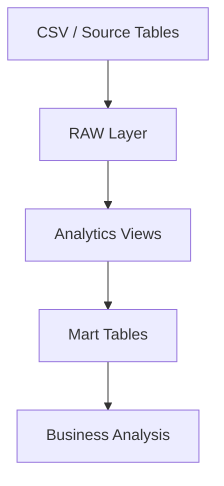

Dataset: [Grocery Sales Dataset on Kaggle](https://www.kaggle.com/datasets/andrexibiza/grocery-sales-dataset)

# Sales Data Analysis with SQL

## Project Overview

This project demonstrates a complete SQL-based data analysis workflow using PostgreSQL.  
The dataset represents a retail sales environment including customers, products, employees, and transactions.

The goal of this project is to:

- Design a structured analytical database
- Perform data cleaning and transformation
- Build a layered data model
- Generate business insights using SQL queries

The project follows a **data warehouse style architecture**:

# Dataset Description

The dataset includes the following core entities:

| Table | Description |
|------|-------------|
| countries | Country reference data |
| cities | City information linked to countries |
| customers | Customer profiles |
| employees | Salesperson information |
| categories | Product category classification |
| products | Product catalog |
| sales | Transaction-level sales records |

---

# Tools Used

- PostgreSQL
- SQL
- Relational data modeling

---

# Author

SQL data analysis project created for learning and portfolio demonstration.
